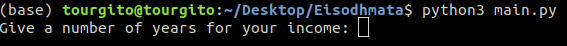

# Python Pandas 

This is a an example of using python's library Pandas. The example has to do with how to process monthly incomes for a specific number of years. The figure 1.1 shows how the software begins.  

 <b>Figure 1.1 How the software begins</b> 

At the beginning, the software askes the user to give as an input the number of the years that the incomes will apply, so that it creates the monthly incomes for each year. In figure 1.2 the user gives as input 3, therefore it will process the incomes of three years, and also figure 1.2 shows the options for the user, related to what the software can do.  

 <b>Figure 1.2 Options for the user</b> 

Next, the figure 1.3 shows that the user choiced the option 3, which shows the monthly incomes for each year.  

 <b>Figure 1.3 Monthly incomes for each year</b> 

The monthly incomes for each year in the figure 1.3 are stored in a Pandas Dataframe, so ones the Dataframe is created the software process that Dataframe, so that it carries out all the others options.

The figure 1.4 show the results of option 6. As its name indicates 'monthly_total_incomes_for_all_years', it calculates the sum of the monthly incomes for all the years.  

 <b> The sum of the monthly incomes for all the years</b> 

The figure 1.5 show the results of option 0. As its name indicates 'annual_total_income_for_each_year', it calculates the annual income for each year.  

 <b> Figure 1.5 The annual income for each year</b> 

The same way that the former options are carried out from the software, so does the rest of the options.

